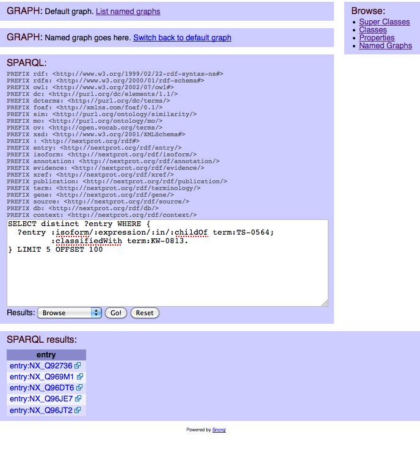

Advanced SPARQL for nextprot with spring-mvc, jena and virtuoso 
===============================================================

This project will help to build a closed world RDF schema by iteration and tests. The schema creation mainly focus on the user queries. It has nothing to do with semantic data in open world. It mainly focus on the user and understandable SPARQL queries. 
> For example, All proteins which are located in **mitochondrion** with an evidence other than **HPA** and **DKFZ-GFP**
```SPARQL
  ?proteins :isoform/:located ?statement.
    ?statement :in/:childOf term:SL-0173 #Mitochondrion ; 
               :withEvidence/:fromXref/owl:disJointWith :HPA,:DKFZ-GFP
```  


It demonstrates the use of a triplestore (open-virtuoso) with Jena and spring-mvc. The purpose of the schema will help the user to write SPARQL with a contextual introspection.

###RDFS and queries,
* [initial rdf schema](src/main/resources/owl)
* [view all sparql queries](src/test/resources/sparql)

###Get your own triplestore instance 
* install open-virtuoso,
* get nextprot triples, 
* install virtuoso jena driver ([download Jena2 provider and jdbc4  jars](http://virtuoso.openlinksw.com/dataspace/doc/dav/wiki/Main/VOSDownload#Jena%20Provider)),
```shell
$mvn install:install-file -Dfile=virt_jena2.jar -DgroupId=virtuoso.jena2 -DartifactId=virtuoso-jena2 -Dversion=2.10.x
$mvn install:install-file -Dfile=virtjdbc4.jar -DgroupId=virtuoso.jdbc4 -DartifactId=virtuoso-jdbc4 -Dversion=4.0
```
* Configure triplestore endpoint
  * in file [main.properties](src/main/resources/config/main.properties) configure your own virtuoso instance or use the public nextprot sparql endpoint
  * if you dont have a virtuoso instance, you can use the public access of nextprot sparql. To do that, you have to uncomment the variable 'sparql.endpoint' in the config/main.properties
  * __NOTE: the public access of nextprot sparql is scheduled for June 2014__

###Test  your configuration: run a single TestClasse
```shell
$mvn -Dtest=Integrity test
```

###Walking the graph
The class [SparqlController.java](src/main/java/evaletolab/controller/SparqlController.java) implement the basic proxying with the triplestore. With a native Jena2 driver, you have the ability to mix, in a single SPARQL query, data from your native datastore and magic properties from Jena ARQ.
```shell
$ mvn jetty:run
```



###Use case for [evidences](src/test/java/evaletolab/rdf/Evidences.java)
 * [Q53](src/test/resources/sparql/Q53-1-involvedInGO0007155_WithEvidence_NotIEA_And_NotISS.sparql)	which are involved in cell adhesion according to GO with an evidence not IAE and not ISS
 * [Q57](src/test/resources/sparql/Q57-locatedInMitochondrionWithEvidenceOtherThan_HPA_And_DKFZ_GFP.sparql)	which are located in mitochondrion with an evidence other than HPA and DKFZ-GFP
 * [Q63](src/test/resources/sparql/Q63-with1RRM_RNAbindingDomainWithEvidenceIEAorISS.sparql)	which have >=1 RRM RNA-binding domain and either no GO "RNA binding" other a GO "RNA binding" with evidence IEA or ISS
 * Q68	with protein evidence PE=2 (transcript level)

###Use case for [expression](src/test/java/evaletolab/rdf/Expression.java)
 * QX  Proteins that are not highly expressed in liver at embrion stage
 * [Q4](src/test/resources/sparql/Q4-highlyExpressedInBrainButNotInTestis.sparql)  highly expressed in brain but not expressed in testis
 * [Q11](src/test/resources/sparql/Q11-expressedInLiverAndInvolvedInTransport.sparql) that are expressed in liver and involved in transport 
 * Q[15](src/test/resources/sparql/Q15-PDZdomainthatInteractWithProteinExpresssedInBrain.sparql) with a PDZ domain that interact with at least 1 protein which is expressed in brain 
 * [Q17](src/test/resources/sparql/Q17-gt1000aaAndLocatedInNucleusAndExpressedInNervousSystem.sparql) >=1000 amino acids and located in nucleus and expression in nervous system 
 * [Q20](src/test/resources/sparql/Q20-HPAOnChromosome21highlyExpresssedInHeartAtIHCLevel.sparql) with >=2 HPA antibodies whose genes are located on chromosome 21 and that are highly expressed at IHC level in heart
 * [Q50](src/test/resources/sparql/Q50-expressedInBrainAccordingIHCButNotExpressedInBrainAccordingMicroarray.sparql) which are expressed in brain according to IHC but not expressed in brain according to microarray
 * [Q77](src/test/resources/sparql/Q77-expressedInLiverAccordingIHCButNotInHUPOLiverProteom.sparql) which are expressed in liver according to IHC data but not found in HUPO liver proteome set
 * Q83 whose genes are on chromosome N that are expressed only a single tissue/organ
 * Q89 which are located in nucleus and expressed in brain and only have orthologs/paralogs in primates

###Use case for [sequence annotations](src/test/java/evaletolab/rdf/Features.java)
 * Q3	Proteins with >=2 transmembrane regions 
 * Q5	Proteins located in mitochondrion and that lack a transit peptide
 * Q9	Proteins with 3 disulfide bonds and that are not hormones 
 * Q13 Proteins with a protein kinase domain but no kinase activity 
 * Q14 Proteins with 2 SH3 domains and 1 SH2 domain 
 * Q15 Proteins with a PDZ domain that interact with at least 1 protein which is expressed in brain 
 * Q16 Proteins with a mature chain <= 100 amino acids which are secreted and do not contain cysteines in the mature chain 
 * Q18 Proteins that are acetylated and methylated and located in the nucleus 
 * Q19 Proteins contains a signal sequence followed by a extracellular domain containing a "KRKR" motif 
 * * Q22 Proteins with no function annotated
 * * Q27 Proteins with >=1 glycosylation sites reported in PubMed:X or PubMed:Y
 * Q32 Proteins with a coiled coil region and involved in transcription but does not contain a bZIP domain
 * Q34 Proteins with >=1 homeobox domain and with >=1 variant in the homeobox domain(s)
 * Q35 Proteins located in the mitochondrion and which is an enzyme
 * Q38 Proteins with >=1 selenocysteine in their sequence
 * Q39 Proteins with >=1 mutagenesis in a position that correspond to an annotated active site
 * Q40 Proteins that are enzymes and with >=1 mutagenesis that "decrease" or "abolish" activity
 * Q41 Proteins that are annotated with GO "F" terms prefixed by "Not"
 * Q48 Proteins with >=1 variants of the type "C->" (Cys to anything else) that are linked to >=1 disease
 * Q49 Proteins with >=1 variants of the types "A->R" or "R->A"

###Use case for general annotations
###Use case for PTM queries


It is compatible with tomcat and jetty maven plugins.

Use
    mvn tomcat7:run
or
    mvn jetty:run

Some sample controller (for SPARQL query provider and jena test) for proteins Expression are also provided.

