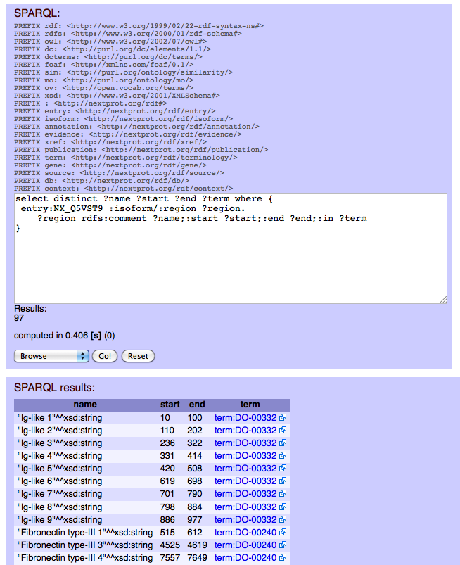

Advanced SPARQL for nextprot with spring-mvc, jena and virtuoso 
===============================================================
The purpose of this document is to give an original way to build and test the new advanced search engine for neXtProt. neXtProt is an on-line knowledge platform on human proteins. It is based on a top-down data integration process, materialized in a central SQL engine (postgres). neXtProt tends to integrate, with a top-down process, a large amount of data provided by independant groups (bottom-up process). Currently, all neXtProt's data can't be easily interrogated because of the lack of an advanced query engine. The nature of bioinformatics data makes this features difficult to achieve. Data are highly interconnected and are difficult to be normalized without adding useless of complexity.
This project proposes a solution to build an advanced query engine, based on the use cases provided by our (main) users. We currently have 91 queries that describe all perspectives of data for the first release. This is our first milestone, it mainly focuses on those queries. 

**This project will help to build a closed world RDF schema by iterations and tests. The schema creation mainly focuses on the user queries. It has nothing to do with semantic data in open world. It emphasizes on understandable SPARQL queries.**
> For example, All proteins which are located in **mitochondrion** with an evidence other than **HPA** and **DKFZ-GFP**

```SPARQL
  ?proteins :isoform/:localisation ?statement.
    ?statement :in/:childOf term:SL-0173 #Mitochondrion ; 
               :withEvidence/:fromXref/:notIn :HPA,:DKFZ-GFP
```
> Or you can get all regions/domains (eg. name, positions and terminology) of a protein 

```SPARQL
  entry:NX_P06213 :isoform/:region ?region.
    ?region rdfs:comment ?name;:start ?start;:end ?end;:in ?term
```
> and plot the result


This project also demonstrates how to use and configure a triplestore (open-virtuoso, fuseki) with Jena and spring-mvc. Following the instructions, you should be able to build your own neXtProt mirror

<!--
###RDFS and queries,
* [initial rdf schema](src/main/resources/owl)
* [view all sparql queries](src/main/resources/sparql)
-->

###Get your own triplestore instance 
* install open-virtuoso 7.x (redhat, ubuntu),
* get the neXtProt triples, 
* install virtuoso jena driver ([download Jena2 provider and jdbc4  jars](http://virtuoso.openlinksw.com/dataspace/doc/dav/wiki/Main/VOSDownload#Jena%20Provider)),
```shell
$mvn install:install-file -Dfile=virt_jena2.jar -DgroupId=virtuoso.jena2 -DartifactId=virtuoso-jena2 -Dversion=2.10.x
$mvn install:install-file -Dfile=virtjdbc4.jar -DgroupId=virtuoso.jdbc4 -DartifactId=virtuoso-jdbc4 -Dversion=4.0
```
* Configure triplestore endpoint
  * in file [main.properties](src/main/resources/config/main.properties) configure your own virtuoso instance or use the public nextprot sparql endpoint
  * if you dont have a virtuoso instance, you can use the public access of nextprot sparql. To do that, you have to uncomment the variable 'sparql.endpoint' in the config/main.properties
  * __NOTE: the public access of nextprot sparql is scheduled for June 2014__

###Test  your configuration: run a single TestClasse
```shell
$mvn -Dtest=Integrity test
```
###Run all rdf tests
* [view all sparql test](src/main/java/evaletolab/rdf)
```shell
$mvn -Dtest=evaletolab.rdf.* test
```

###Walking the graph
The class [SparqlController.java](src/main/java/evaletolab/controller/SparqlController.java) implement the basic proxying with the triplestore. With a native Jena2 driver, you have the ability to mix, in a single SPARQL query, data from your native datastore and magic properties from Jena ARQ.
```shell
$ mvn jetty:run
$ ff localhost:6969
```



###Use case for [evidences](src/main/java/evaletolab/rdf/Evidences.java)
* [Q53](src/main/resources/sparql/Q53-1.sparql)	which are involved in cell adhesion according to GO with an evidence not IAE and not ISS
* [Q57](src/main/resources/sparql/Q57-locatedInMitochondrionWithEvidenceOtherThan_HPA_And_DKFZ_GFP.sparql)	which are located in mitochondrion with an evidence other than HPA and DKFZ-GFP
* [Q63](src/main/resources/sparql/Q63-with1RRM_RNAbindingDomainWithEvidenceIEAorISS.sparql)	which have >=1 RRM RNA-binding domain and either no GO "RNA binding" other a GO "RNA binding" with evidence IEA or ISS

###Use case for [expression](src/main/java/evaletolab/rdf/Expression.java)
* QX  Proteins that are not highly expressed in liver at embrion stage
* [Q4](src/main/resources/sparql/Q4.sparql)  highly expressed in brain but not expressed in testis
* [Q11](src/main/resources/sparql/Q11.sparql) that are expressed in liver and involved in transport 
* Q[15](src/main/resources/sparql/Q15.sparql) with a PDZ domain that interact with at least 1 protein which is expressed in brain 
* [Q17](src/main/resources/sparql/Q17.sparql) >=1000 amino acids and located in nucleus and expression in nervous system 
* [Q20](src/main/resources/sparql/Q20.sparql) with >=2 HPA antibodies whose genes are located on chromosome 21 and that are highly expressed at IHC level in heart
* [Q50](src/main/resources/sparql/Q50.sparql) which are expressed in brain according to IHC but not expressed in brain according to microarray
* [Q77](src/main/resources/sparql/Q77.sparql) which are expressed in liver according to IHC data but not found in HUPO liver proteome set
* [Q83](./src/main/resources/sparql/Q83.sparql) whose genes are on chromosome N that are expressed only a single tissue/organ
* Q89 which are located in nucleus and expressed in brain and only have orthologs/paralogs in primates

###Use case for [sequence annotations](src/main/java/evaletolab/rdf/Features.java)
* [Q3](src/main/resources/sparql/Q3.sparql)	Proteins with >=2 transmembrane regions 
* [Q5](src/main/resources/sparql/Q5.sparql)	Proteins located in mitochondrion and that lack a transit peptide
* [Q9](src/main/resources/sparql/Q9.sparql)	Proteins with 3 disulfide bonds and that are not hormones 
* [Q13](src/main/resources/sparql/Q13.sparql) Proteins with a protein kinase domain but no kinase activity 
* [Q14](src/main/resources/sparql/Q14.sparql) Proteins with 2 SH3 domains and 1 SH2 domain 
* [Q15](src/main/resources/sparql/Q15.sparql) Proteins with a PDZ domain that interact with at least 1 protein which is expressed in brain 
* [Q16](src/main/resources/sparql/Q16-1.sparql), [Q16a](src/main/resources/sparql/Q16-2.sparql) [Q16b](src/main/resources/sparql/Q16-3.sparql), Proteins with a mature chain <= 100 amino acids which are secreted and do not contain cysteines in the mature chain 
* [Q18](src/main/resources/sparql/Q18.sparql) Proteins that are acetylated and methylated and located in the nucleus 
* [Q19](src/main/resources/sparql/Q19.sparql) Proteins contains a signal sequence followed by a extracellular domain containing a "KRKR" motif 
* Q27 Proteins with >=1 glycosylation sites reported in PubMed:X or PubMed:Y
* [Q32](src/main/resources/sparql/Q32.sparql) Proteins with a coiled coil region and involved in transcription but does not contain a bZIP domain
* [Q34](src/main/resources/sparql/Q34.sparql) Proteins with >=1 homeobox domain and with >=1 variant in the homeobox domain(s)
* [Q35](src/main/resources/sparql/Q35.sparql) Proteins located in the mitochondrion and which is an enzyme
* [Q38](src/main/resources/sparql/Q38.sparql) Proteins with >=1 selenocysteine in their sequence
* [Q39](src/main/resources/sparql/Q39.sparql) Proteins with >=1 mutagenesis in a position that correspond to an annotated active site
* [Q40](src/main/resources/sparql/Q40.sparql) Proteins that are enzymes and with >=1 mutagenesis that "decrease" or "abolish" activity
* [Q41](src/main/resources/sparql/Q41.sparql) Proteins that are annotated with GO "F" terms prefixed by "Not"
* [Q48](src/main/resources/sparql/Q48.sparql) Proteins with >=1 variants of the type "C->" (Cys to anything else) that are linked to >=1 disease
* [Q49](src/main/resources/sparql/Q49.sparql) Proteins with >=1 variants of the types "A->R" or "R->A"

###Use case for general [annotations](src/main/java/evaletolab/rdf/Interaction.java)
* [Q24](src/main/resources/sparql/Q24.sparql) Proteins with >1 reported gold interaction
* [Q25](src/main/resources/sparql/Q25.sparql) Proteins with >=50 interactors and not involved in a disease
* [Q26](src/main/resources/sparql/Q26.sparql) Proteins interacting with >=1 protein located in the mitochondrion
  
###Use case for general [annotations](src/main/java/evaletolab/rdf/General.java)
* [Q1](src/main/resources/sparql/Q1.sparql) Proteins that are phosphorylated and located in the cytoplasm 
* [Q2](src/main/resources/sparql/Q2.sparql) Proteins that are located both in the cytoplasm and in the nucleus
* [Q5](src/main/resources/sparql/Q5.sparql) Proteins located in mitochondrion and that lack a transit peptide
* [Q6](src/main/resources/sparql/Q6.sparql) Proteins whose genes are on chromosome 2 and linked with a disease
* [Q7](src/main/resources/sparql/Q7.sparql) Proteins linked to diseases that are associated with cardiovascular aspects
* [Q8](src/main/resources/sparql/Q8.sparql) Proteins whose genes are x bp away from the location of the gene of protein Y
* [Q22](src/main/resources/sparql/Q22.sparql) Proteins with no function annotated
* [Q31](src/main/resources/sparql/Q31.sparql) Proteins with >=10 "splice" isoforms
* [Q32](src/main/resources/sparql/Q32.sparql) Proteins with a coiled coil region and involved in transcription but does not contain a bZIP domain
* [Q68](src/main/resources/sparql/Q68.sparql)	Proteins with protein evidence PE=2 (transcript level)
* [Q65](src/main/resources/sparql/Q65.sparql) Proteins with >1 catalytic activity 
* [Q73](src/main/resources/sparql/Q73.sparql) Proteins with no domain 

###Use case for [Xref](src/main/java/evaletolab/rdf/Xref.java) queries  
* [Q72](src/main/resources/sparql/Q72.sparql) Proteins with a cross-reference to CCDS

###Use case for [3Dstructure](src/main/java/evaletolab/rdf/_3Dstructure.java) queries  
* [Q108](src/main/resources/sparql/Q108.sparql)  All proteins that have a 3D structure in PDB that overlap by at least 50 amino acids with a SH3 domain.

###Use case for [Peptide](src/main/java/evaletolab/rdf/Peptide.java) queries  
* [Q75](src/main/resources/sparql/Q75.sparql) Proteins which have been detected in the HUPO liver proteome set but not the HUPO plasma proteome set
* [Q109](src/main/resources/sparql/Q109.sparql) All proteins that have a peptide that maps partly or fully into a signal sequence

###Use case for [PTM](src/main/java/evaletolab/rdf/PTM.java) queries  
* [Q10](src/main/resources/sparql/Q10.sparql) Proteins that are glycosylated and not located in the membrane
* [Q66](src/main/resources/sparql/Q66.sparql) Proteins that are cytoplasmic with alternate O-glycosylation or phosphorylation at the same positions
* [Q67](src/main/resources/sparql/Q67.sparql) Proteins with alternative acetylation or Ubl conjugation (SUMO or Ubiquitin) at the same positions


It is compatible with tomcat and jetty maven plugins.

Use
    mvn tomcat7:run
or
    mvn jetty:run

Some sample controller (for SPARQL query provider and jena test) for proteins Expression are also provided.

